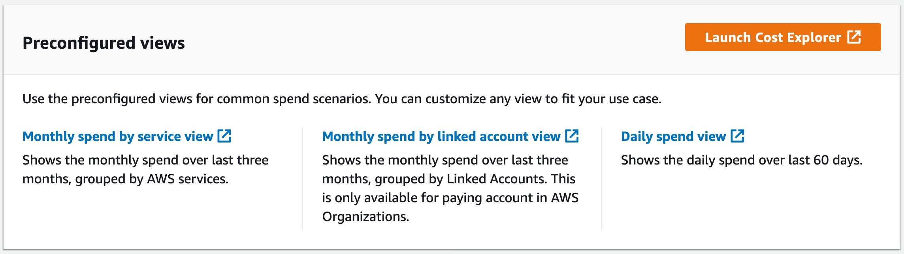
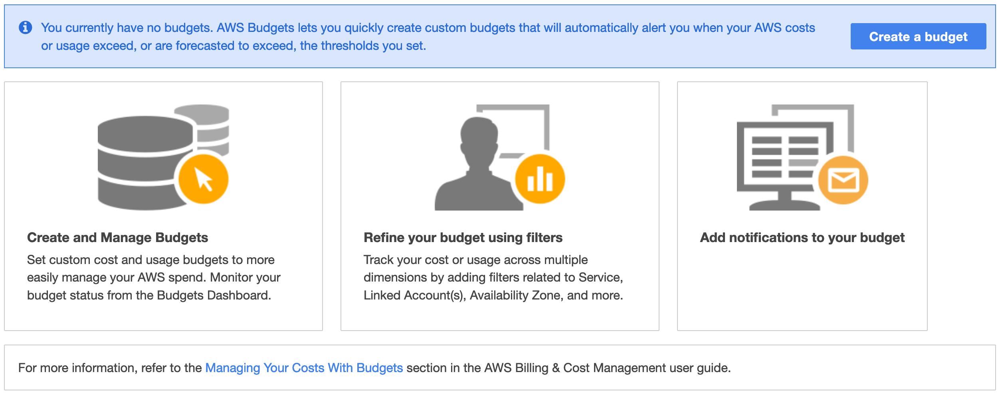

# Understanding Cloud Economics

## Table of Contents

<!-- START doctoc generated TOC please keep comment here to allow auto update -->
<!-- DON'T EDIT THIS SECTION, INSTEAD RE-RUN doctoc TO UPDATE -->

- [AWS Cost Explorer](#aws-cost-explorer)
- [AWS Budgets](#aws-budgets)
- [References](#references)

<!-- END doctoc generated TOC please keep comment here to allow auto update -->

### AWS Cost Explorer

### AWS Budgets

Utilizes data from **AWS Cost Explorer** to plan and track your usage across AWS services.
 It can track cost per service, service usage,
reserved instance utilization and coverage, and Savings Plans utilization and coverage.

> AWS Budgets provides you with the ability to quickly set custom budgets
>  that will alert you if you exceed (or are forecasted to exceed) your budget,
>  making it easy to monitor your costs at scale.

 

How you can use AWS Budgets to set a custom cost budget that tracks your costs at the monthly level,
configure alerts that will notify you when your user-defined spend thresholds are reached,
and show you how you can use AWS Budgets to monitor your overarching budget portfolio.

## References
